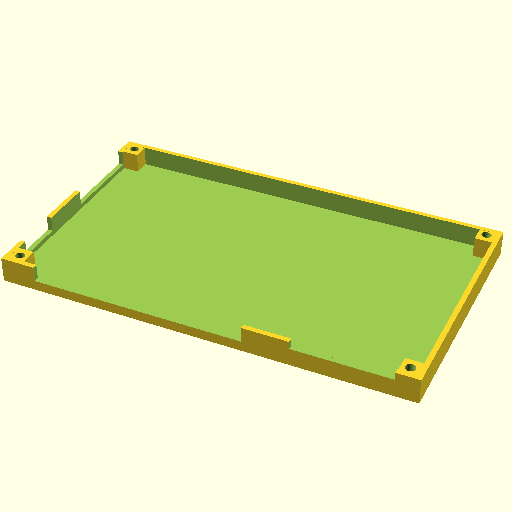

# 3D-printable enclosure for the Moddable-2

You will need:

* A 3D printer and filament (such as PLA)
* 4x M2 x 8mm screws

To print:

* Use the provided STL file with slicer software and parameters that
  work with your 3D printer.
* Or, use the provided OpenSCAD file, convert it into STL with OpenSCAD
  and use that instead. (If you are a software geek, all you need to
  say is `make` in this directory. If this means nothing to you, just
  run OpenSCAD, render, and export STL.)

We used:

* Prusa i3, PLA, and "Normal" settings in Slic3r

Note:

* The screws need to self-cut into the printed enclosure. Depending on
  your printer, and and your filament, and your settings, and probably
  a few other things, you may need to adjust the radius of the holes so
  the screws fit snugly. This is parameter `hole_r` in the OpenSCAD file.

